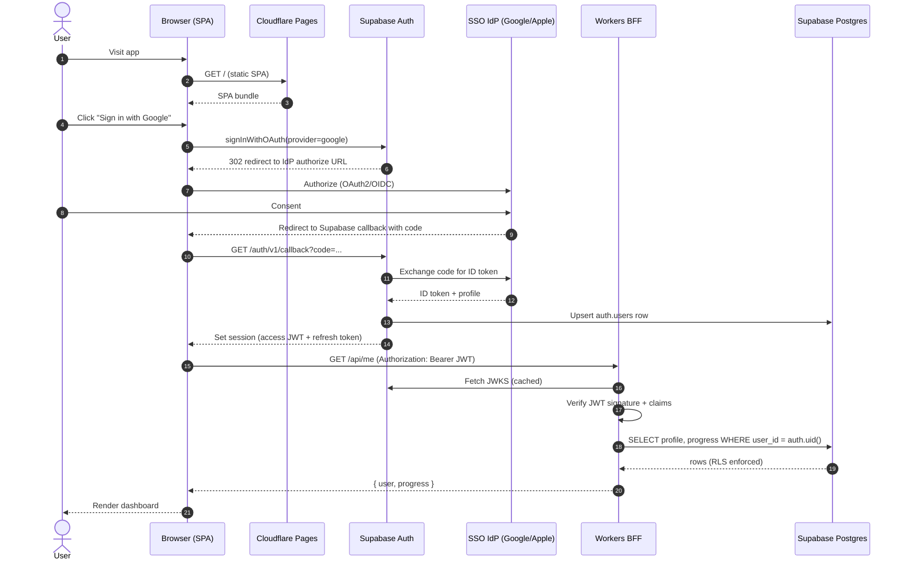

# Zeus-Eval Architecture

Cost-optimized architecture for an interactive e-learning platform for dev tools
(Redis, Kubernetes, Docker, …). Each problem gives the user a persistent
browser-based shell into an isolated environment.

Target: **personal budget (<$50/mo at launch)**, launch-ready reliability,
clear upgrade path when traffic grows.

---

## 1. Requirements recap

| Area | Requirement |
|---|---|
| Isolation | Per-user sandbox per problem (filesystem, processes, network) |
| Session | Persistent — user can disconnect and resume where they left off |
| Interface | Browser-based terminal (no local SSH client required) |
| Auth | SSO only (Google, Apple, etc.) — no passwords; per-user state, progress tracking |
| Availability | "Launch-ready": fast recovery, no data loss; full HA is out of scope at this budget |
| Cost | ≤ ~$50/mo at 0–100 DAU, scales sub-linearly |

---

## 2. High-level architecture

```
┌─────────────────────────────────────────────────────────────────────┐
│                            User browser                             │
│  ┌──────────────┐      ┌──────────────────────────────────────┐     │
│  │ Static SPA   │      │ xterm.js  ── WebSocket ──┐           │     │
│  │ (React/…)    │      └──────────────────────────┼───────────┘     │
│  └──────┬───────┘                                 │                 │
└─────────┼─────────────────────────────────────────┼─────────────────┘
          │ HTTPS                                   │ WSS
          ▼                                         │
  ┌──────────────────┐                              │
  │ Cloudflare Pages │   static assets, free        │
  └──────────────────┘                              │
          │                                         │
          │ fetch()                                 │
          ▼                                         │
  ┌──────────────────────────────┐                  │
  │ Cloudflare Workers  (BFF)    │◄─── Supabase Auth (JWT)
  │  - verify JWT                │                  │
  │  - route: /api/*             │                  │
  │  - rate limit, CORS, WAF     │                  │
  └──────┬───────────────────────┘                  │
         │                                          │
         │ authenticated calls                      │
         ▼                                          │
  ┌──────────────────────────────┐                  │
  │ Supabase (Auth + Postgres)   │   user, progress, problem catalog
  └──────────────────────────────┘                  │
         │                                          │
         │ "provision sandbox for user X, problem Y"│
         ▼                                          │
  ┌──────────────────────────────────────────────────────────────┐
  │                  Hetzner Cloud — K3s cluster                 │
  │                                                              │
  │  ┌────────────┐   ┌──────────────────┐   ┌────────────────┐  │
  │  │ control-pl.│   │ Session Manager  │   │ Terminal Proxy │  │
  │  │  (CX22)    │   │ (custom svc)     │◄──│ (WS → exec)    │◄─┘
  │  └────────────┘   │ - provision pod  │   └────────────────┘
  │                   │ - idle reap      │
  │                   │ - hibernate/rest │
  │                   └────────┬─────────┘
  │                            │ k8s API
  │                            ▼
  │  ┌────────────────────────────────────────────────────────┐  │
  │  │ User sandbox namespace (per user, per problem)         │  │
  │  │  - Pod (alpine/ubuntu + tool-specific image)           │  │
  │  │  - PVC (Hetzner volume or Longhorn)                    │  │
  │  │  - NetworkPolicy: deny all egress except allowlist     │  │
  │  │  - ResourceQuota: 0.25 CPU, 256Mi default              │  │
  │  └────────────────────────────────────────────────────────┘  │
  └──────────────────────────────────────────────────────────────┘
```

---

## 3. Component choices and why

### 3.1 Frontend — Next.js (static export) on Cloudflare Pages

Built and lives under [`web/`](../web). Static-exported (`output: 'export'` in
`next.config.ts`), so the deploy artifact is plain HTML/JS/CSS — perfect fit
for CF Pages' free tier, no Node runtime needed on the edge.

### 3.2 BFF — Cloudflare Workers (this is the key change from your plan)

You proposed "no BFF, browser talks to K3s directly." I strongly recommend against this:

| Without BFF | With Workers BFF |
|---|---|
| K3s API / app services exposed to public internet | Only Workers expose a public surface; K3s sits behind it |
| Auth/authZ logic duplicated in every backend service | Centralized JWT verification, rate limiting, CORS |
| DDoS hits your cluster directly | Cloudflare absorbs it |
| Every bug is public | Bugs in internal services stay internal |
| "Free" | **Free tier: 100k req/day, 10ms CPU/req** — covers your scale |

Workers give you a BFF with **zero additional cost** and **zero servers to run**. This is almost always the right call for a CF-Pages-fronted app.

The Worker:
- Verifies the JWT (Supabase issues them, Workers verify with JWKS - JSON Web Key Set).
- Talks to Postgres for user/progress data.
- Signs a short-lived token for the terminal WebSocket (WS) connection and issues a provisioning request to the Session Manager inside K3s via a **private tunnel** (Cloudflare Tunnel, free) — so the K3s cluster never needs a public ingress for the control path.
- Returns the WS URL for the terminal (which is the only public endpoint on K3s, behind Cloudflare proxy).

### 3.3 Auth — Supabase Auth (SSO only)
- Don't roll your own. Supabase Auth is unlimited on the free tier and shares the same project as the Postgres DB below — one provider, one dashboard, one set of credentials to rotate.
- Issues JWTs that Workers + Session Manager verify via the Supabase JWKS endpoint.
- **SSO-only**: Google and Apple (Sign in with Apple) at launch; GitHub/Microsoft easy to add later. Email/password sign-up is **disabled** in Supabase Auth settings — no password reset flows, no email verification to build, no credential stuffing surface.
- Why SSO-only: zero password handling, fewer abuse vectors (throwaway email signups), faster onboarding, and Apple covers users who won't use Google.
- Row-Level Security (RLS) policies in Postgres key off `auth.uid()` for defense in depth.
- Note: Apple requires a paid Apple Developer account ($99/yr) to issue the Services ID and keys. Budget accordingly, or launch with Google-only and add Apple post-launch.

### 3.4 Database — Supabase (Postgres)
- Bundled with Auth above. Free tier: 500 MB DB, 1 GB file storage, 2 GB egress, 50k MAU. Plenty for launch.
- Pooled connections via Supavisor (Workers get transient connections, no persistent pool needed).
- Nightly logical backups included; pair with your own `pg_dump` → Backblaze B2 for off-provider redundancy (see §5).
- Upgrade path: $25/mo Pro tier when you outgrow free — 8 GB DB, daily PITR, no pause-on-idle.

### 3.5 Compute — Hetzner K3s (keep your choice, with refinements)

**Cluster sizing (launch):**
| Role | Node | Cost |
|---|---|---|
| Control plane + system + session manager | 1× CX22 (2 vCPU, 4 GB) | €3.79/mo |
| Worker (user sandboxes) | 1× CX32 (4 vCPU, 8 GB) | €6.49/mo |
| Volumes (Hetzner Volume, 20 GB) | shared | €0.80/mo |
| **Total** | | **~€11/mo (~$12)** |

Scale by adding CX32 workers as DAU grows. K3s handles joining new nodes in <2min.

**Why not EKS/GKE?** Control plane alone is $70+/mo. Not viable at this budget.

**Why K3s over vanilla k8s?** Lower memory footprint, single binary, embedded SQLite (or external Postgres for HA later).

### 3.6 Sandbox lifecycle — the biggest cost lever

Naïve per-user pods: 100 users × 256 Mi = 25 GB RAM needed. One CX32 = 8 GB. You'd need 4 nodes = ~€26/mo just for idle pods.

**Solution: aggressive hibernation.**

| State | What exists | Cost |
|---|---|---|
| Active (user connected) | Pod running, PVC mounted | Full |
| Idle (disconnected <10min) | Pod running (fast reconnect) | Full |
| Hibernated (>10min idle) | Pod deleted, PVC retained | Storage only (~€0.04/GB/mo) |
| Abandoned (>30 days idle) | PVC deleted, progress saved in Postgres | $0 |

On reconnect after hibernation: Session Manager recreates the pod with the same PVC mounted (~5-10s cold start). User sees "resuming session…" and is back where they left off.

This turns per-user cost from "1 pod always running" to "pod runs only while actively used." At 100 DAU with 30 min avg session, concurrent pods ≈ 2-5.

### 3.7 Terminal proxy

User browser ↔ `wss://term.example.com/session/<id>` → CF proxy → Ingress → `Terminal Proxy` pod → `kubectl exec` into sandbox pod. xterm.js on the client; `github.com/creack/pty` + gorilla/websocket on the server is a ~200-line Go service.

**Security:**
- WS URL includes a short-lived (5 min) signed token scoped to one pod.
- Terminal proxy validates token, looks up pod, execs in. No kubeconfig leaves the cluster.

### 3.8 Sandbox hardening

Each sandbox pod:
- **NetworkPolicy**: deny all egress except DNS + per-problem allowlist (e.g. Redis problem allows only 127.0.0.1, Kubernetes-in-Kubernetes problem allows the kind API).
- **ResourceQuota**: CPU/mem/PID limits, ephemeral storage cap.
- **Namespace per user**: clean teardown, blast radius contained.
- **No service account token** mounted by default.
- **gVisor or Kata Containers** (optional, future): stronger isolation for untrusted code. Adds ~10% overhead — skip at launch, add when you have actual untrusted-code problems (e.g. "run this attacker's Redis command").
- **Read-only root filesystem** where the problem allows it.
- **Pod egress via egress gateway** so you can bill/monitor outbound bandwidth (Hetzner includes 20 TB/node, generous).

### 3.9 Ingress & TLS
- Traefik (bundled with K3s) as ingress controller.
- cert-manager + Let's Encrypt for TLS. Free.
- Cloudflare in front (orange cloud) → hides origin IP, adds DDoS protection, free.
- Single public LB: Hetzner Load Balancer LB11 (€5.39/mo) or skip the LB and use the worker node's public IP with a floating IP (€0.50/mo) for launch.

### 3.10 Observability
- **Logs**: Grafana Cloud free tier (50 GB logs, 10k series metrics) — ship with Alloy/Promtail.
- **Metrics**: same, via kube-prometheus-stack → remote-write to Grafana Cloud.
- **Uptime**: Better Stack or UptimeRobot free tier.

### 3.11 CI/CD
- GitHub Actions (free for public, generous free tier for private).
- Frontend → CF Pages auto-deploy on push.
- Backend services → build image → push to GHCR (free) → ArgoCD or Flux pulls into cluster. Or simpler: `kubectl apply` from GHA via a tunnel.

---

## 3.12 SSO login sequence



Notes:
- Supabase handles the OAuth dance; the SPA never sees the IdP's tokens, only Supabase's JWT.
- The Worker verifies JWTs against Supabase's JWKS (cached) — no round-trip to Supabase per request.
- Postgres Row-Level Security keys off `auth.uid()` from the JWT, so even a compromised Worker can't read other users' rows.
- Refresh is handled by the Supabase client SDK in the browser; the Worker is stateless.

---

## 4. Cost summary (launch, ~0-100 DAU)

| Item | Cost/mo |
|---|---|
| Cloudflare Pages | $0 |
| Cloudflare Workers | $0 (free tier) |
| Cloudflare Tunnel | $0 |
| Supabase (Auth + Postgres) | $0 (free tier) |
| Hetzner K3s (1× CX22 + 1× CX32) | ~$12 |
| Hetzner Volume (20 GB) | ~$1 |
| Hetzner LB (optional) | ~$6 |
| Grafana Cloud | $0 (free tier) |
| Domain | ~$1 |
| **Total** | **~$14-20/mo** |

Headroom to $50/mo: add 3-4 more CX32 workers → supports ~500 DAU concurrent.

---

## 5. Availability — honest assessment

At this budget you **cannot** achieve true HA. What you *can* achieve:

| Failure | Mitigation | Recovery |
|---|---|---|
| Sandbox pod crashes | K8s restarts; PVC persists user's work | <30s |
| Worker node dies | Sandboxes on that node lost; Session Manager schedules replacements on reconnect | <2 min for new pod; user work intact (PVC on separate volume service) |
| Control plane node dies | Cluster read/write stops; existing sandboxes keep running | Manual: restore from Hetzner snapshot (hourly backups, ~10 min RTO) |
| Hetzner region outage | Everything down | Cold-restore from backups in another Hetzner DC (~30-60 min RTO). Document runbook. |
| Supabase / CF outage | Depends on component | Out of your hands; use status pages |
| Data loss | Nightly `pg_dump` → Backblaze B2 (free 10 GB) + Hetzner volume snapshots daily | RPO ≤ 24 h |

**Be explicit on the site**: "Platform uptime target 99% (~7h/mo). Your work is backed up; sandboxes may occasionally be interrupted."

**Upgrade paths** when budget allows:
1. Add second control-plane node + external etcd/Postgres (~+$10/mo) — removes control-plane SPOF.
2. Cross-region async replica of Postgres — faster DR.
3. Second K3s cluster in another Hetzner DC, DNS failover (~2x cost).

---

## 6. Suggested build order

1. **Week 1-2**: Static site on CF Pages + Supabase auth. Dummy "start sandbox" button.
2. **Week 2-3**: Hetzner + K3s + one sandbox image (Redis). Terminal proxy. Manual pod provisioning.
3. **Week 3-4**: Session Manager (Go) — provision/hibernate/reap. Cloudflare Tunnel.
4. **Week 4-5**: Workers BFF. Wire end-to-end.
5. **Week 5-6**: NetworkPolicy + ResourceQuota hardening. Observability. Backups.
6. **Week 6+**: Second problem (Kubernetes-in-Kubernetes via kind). Iterate.

Keep the Session Manager and Terminal Proxy as **one tiny Go service** at launch — split later if needed. Avoids premature complexity.

---

## 7. Things deliberately deferred

- Multi-region / multi-cloud HA — cost prohibitive, overkill pre-PMF.
- gVisor/Kata — add when a problem requires running untrusted user code that could break out of a container.
- Autoscaling cluster nodes — do manually until you hit ~200 DAU.
- Per-user billing / paid tier — architecture supports it (Stripe + Workers), build when you have users.
- Full-blown GitOps (Argo/Flux) — `kubectl apply` from CI is fine at this scale.

---

## 8. Open questions for you

1. **What problems launch first?** Sandbox image size and resource needs drive node sizing. Redis pod = 128 Mi. Kubernetes-in-Kubernetes (kind) = 2 GB+.
2. **Free vs paid tier?** If free-only at launch, add abuse protection (per-IP rate limits on sandbox creation; SSO-only auth already blocks throwaway-email signups).
3. **Target region?** Hetzner has DE, FI, US-East, US-West, SG. Pick closest to your primary audience — latency matters for interactive terminals.
4. **Do any problems need internet access** (e.g. `apt install` inside sandbox)? Changes NetworkPolicy design.
